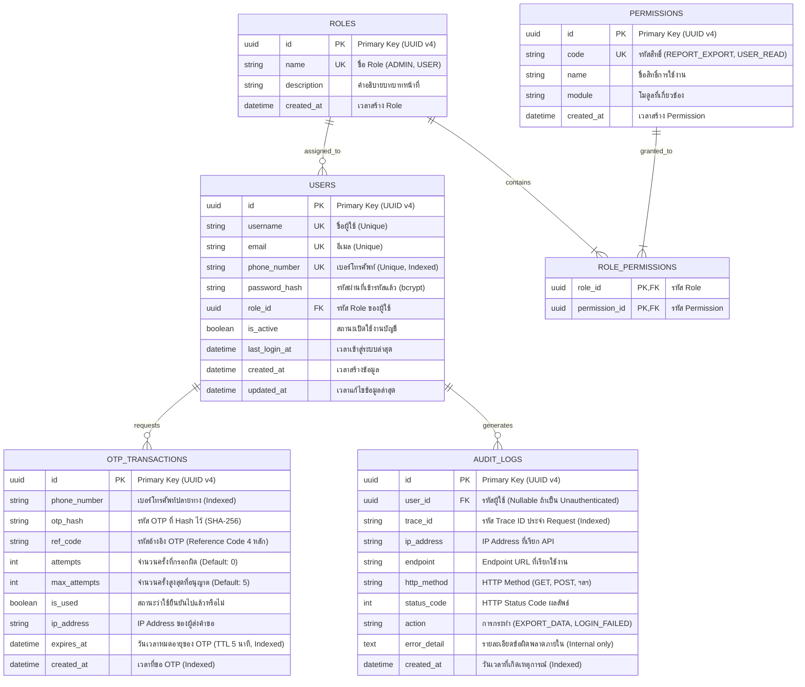

# เอกสารการออกแบบฐานข้อมูล (Database Design Document)
## โครงการ: Backend API Security & Core Hardening MVP (กลุ่ม 1)

---

### 1. ภาพรวมการออกแบบฐานข้อมูล (Database Architecture Overview)

ระบบฐานข้อมูลได้รับการออกแบบเพื่อรองรับฟังก์ชันการรักษาความปลอดภัย (Security Hardening), การยืนยันตัวตนและการจัดการสิทธิ์ (Authentication & RBAC), การควบคุมความถี่ OTP (Rate Limiting), และการบันทึกประวัติด้านความมั่นคงปลอดภัย (Audit Trail)

* **Database Engine:** PostgreSQL 15+ / MySQL 8.0+
* **Primary Key Strategy:** UUID v4 (ป้องกันการเดา ID จากภายนอกแบบ Sequential ID Attack)
* **Timestamp Standard:** UTC ISO-8601 (`TIMESTAMPTZ` หรือ `DATETIME`)

---

### 2. แผนภาพความสัมพันธ์ของข้อมูล (Entity-Relationship Diagram - ERD)



---

### 3. พจนานุกรมข้อมูล (Data Dictionary)

#### 3.1 ตาราง `users` (ตารางข้อมูลผู้ใช้งาน)
| Column Name | Data Type | Constraints | Description |
| :--- | :--- | :--- | :--- |
| `id` | `UUID` | PK, Not Null | รหัสประจำตัวผู้ใช้ (UUID v4) |
| `username` | `VARCHAR(50)` | Unique, Not Null | ชื่อบัญชีผู้ใช้งาน |
| `email` | `VARCHAR(100)` | Unique, Not Null | ที่อยู่อีเมล |
| `phone_number` | `VARCHAR(20)` | Unique, Not Null, Indexed | เบอร์โทรศัพท์สำหรับขอรับ OTP |
| `password_hash` | `VARCHAR(255)` | Not Null | รหัสผ่านที่ผ่านการ Hash (bcrypt/Argon2) |
| `role_id` | `UUID` | FK $\rightarrow$ `roles.id`, Not Null | รหัส Role กำหนดสิทธิ์การใช้งาน |
| `is_active` | `BOOLEAN` | Default: `true` | สถานะเปิด/ปิดการใช้งานบัญชี |
| `last_login_at` | `TIMESTAMPTZ` | Nullable | วันเวลาที่เข้าสู่ระบบล่าสุด |
| `created_at` | `TIMESTAMPTZ` | Default: `NOW()` | วันเวลาที่ลงทะเบียน |
| `updated_at` | `TIMESTAMPTZ` | Default: `NOW()` | วันเวลาที่แก้ไขข้อมูลล่าสุด |

#### 3.2 ตาราง `roles` (ตารางบทบาทหน้าที่)
| Column Name | Data Type | Constraints | Description |
| :--- | :--- | :--- | :--- |
| `id` | `UUID` | PK, Not Null | รหัส Role (UUID v4) |
| `name` | `VARCHAR(50)` | Unique, Not Null | ชื่อ Role เช่น `ADMIN`, `OFFICER`, `USER` |
| `description` | `VARCHAR(255)` | Nullable | คำอธิบายหน้าที่ความรับผิดชอบ |
| `created_at` | `TIMESTAMPTZ` | Default: `NOW()` | วันเวลาที่สร้าง Role |

#### 3.3 ตาราง `permissions` (ตารางสิทธิ์การทำงาน)
| Column Name | Data Type | Constraints | Description |
| :--- | :--- | :--- | :--- |
| `id` | `UUID` | PK, Not Null | รหัส Permission (UUID v4) |
| `code` | `VARCHAR(50)` | Unique, Not Null | รหัสสิทธิ์ เช่น `REPORT_EXPORT`, `USER_READ` |
| `name` | `VARCHAR(100)` | Not Null | ชื่อสิทธิ์ภาษาที่เข้าใจง่าย |
| `module` | `VARCHAR(50)` | Not Null | ชื่อโมดูลของระบบ |
| `created_at` | `TIMESTAMPTZ` | Default: `NOW()` | วันเวลาที่สร้าง Permission |

#### 3.4 ตาราง `role_permissions` (ตารางจับคู่ Role และ Permission)
| Column Name | Data Type | Constraints | Description |
| :--- | :--- | :--- | :--- |
| `role_id` | `UUID` | PK, FK $\rightarrow$ `roles.id` | รหัส Role |
| `permission_id` | `UUID` | PK, FK $\rightarrow$ `permissions.id` | รหัส Permission |

#### 3.5 ตาราง `otp_transactions` (ตารางควบคุมและตรวจสอบ OTP)
| Column Name | Data Type | Constraints | Description |
| :--- | :--- | :--- | :--- |
| `id` | `UUID` | PK, Not Null | รหัส OTP Transaction (UUID v4) |
| `phone_number` | `VARCHAR(20)` | Not Null, Indexed | เบอร์โทรศัพท์ปลายทางที่ขอ OTP |
| `otp_hash` | `VARCHAR(255)` | Not Null | รหัส OTP ที่ผ่านการ Hash (ห้ามเก็บ Plain Text) |
| `ref_code` | `VARCHAR(10)` | Not Null | รหัส Reference Code 4-6 ตัวอักษรแสดงบน SMS |
| `attempts` | `INT` | Default: `0` | จำนวนครั้งที่กรอกรหัสผิด |
| `max_attempts` | `INT` | Default: `5` | จำนวนครั้งสูงสุดที่อนุญาตให้กรอกผิด |
| `is_used` | `BOOLEAN` | Default: `false` | สถานะว่ารหัสนี้ถูกใช้ยืนยันสำเร็จไปแล้วหรือไม่ |
| `ip_address` | `VARCHAR(45)` | Not Null | Client IP Address ที่ส่งคำขอ |
| `expires_at` | `TIMESTAMPTZ` | Not Null, Indexed | วันเวลาหมดอายุของ OTP (TTL 5 นาที) |
| `created_at` | `TIMESTAMPTZ` | Default: `NOW()`, Indexed | วันเวลาที่ส่งคำขอสร้าง OTP |

#### 3.6 ตาราง `audit_logs` (ตารางบันทึกเหตุการณ์ความปลอดภัย)
| Column Name | Data Type | Constraints | Description |
| :--- | :--- | :--- | :--- |
| `id` | `UUID` | PK, Not Null | รหัส Audit Log Record (UUID v4) |
| `user_id` | `UUID` | FK $\rightarrow$ `users.id`, Nullable | รหัสผู้ใช้งาน (Null หากเป็น Guest/Unauthenticated) |
| `trace_id` | `VARCHAR(64)` | Not Null, Indexed | รหัส Unique Trace ID ประจำ Request |
| `ip_address` | `VARCHAR(45)` | Not Null | IP Address ของ Client |
| `endpoint` | `VARCHAR(255)` | Not Null | URL Path ที่ถูกเรียกใช้งาน |
| `http_method` | `VARCHAR(10)` | Not Null | HTTP Method (`GET`, `POST`, ฯลฯ) |
| `status_code` | `INT` | Not Null | HTTP Status Code ที่ตอบกลับไป |
| `action` | `VARCHAR(50)` | Not Null | ชื่อ Action เช่น `EXPORT_DATA`, `LOGIN_FAIL` |
| `error_detail` | `TEXT` | Nullable | Stack Trace หรือ Internal Error ฉบับเต็ม |
| `created_at` | `TIMESTAMPTZ` | Default: `NOW()`, Indexed | วันเวลาที่เกิดเหตุการณ์ |

---

### 4. ตัวอย่าง SQL DDL Scripts (PostgreSQL Compatible)

```sql
-- เปิด Extension สำหรับ UUID
CREATE EXTENSION IF NOT EXISTS "uuid-ossp";

-- 1. ตาราง Roles
CREATE TABLE roles (
    id UUID PRIMARY KEY DEFAULT uuid_generate_v4(),
    name VARCHAR(50) UNIQUE NOT NULL,
    description VARCHAR(255),
    created_at TIMESTAMPTZ DEFAULT NOW()
);

-- 2. ตาราง Permissions
CREATE TABLE permissions (
    id UUID PRIMARY KEY DEFAULT uuid_generate_v4(),
    code VARCHAR(50) UNIQUE NOT NULL,
    name VARCHAR(100) NOT NULL,
    module VARCHAR(50) NOT NULL,
    created_at TIMESTAMPTZ DEFAULT NOW()
);

-- 3. ตาราง Role_Permissions
CREATE TABLE role_permissions (
    role_id UUID REFERENCES roles(id) ON DELETE CASCADE,
    permission_id UUID REFERENCES permissions(id) ON DELETE CASCADE,
    PRIMARY KEY (role_id, permission_id)
);

-- 4. ตาราง Users
CREATE TABLE users (
    id UUID PRIMARY KEY DEFAULT uuid_generate_v4(),
    username VARCHAR(50) UNIQUE NOT NULL,
    email VARCHAR(100) UNIQUE NOT NULL,
    phone_number VARCHAR(20) UNIQUE NOT NULL,
    password_hash VARCHAR(255) NOT NULL,
    role_id UUID NOT NULL REFERENCES roles(id),
    is_active BOOLEAN DEFAULT TRUE,
    last_login_at TIMESTAMPTZ,
    created_at TIMESTAMPTZ DEFAULT NOW(),
    updated_at TIMESTAMPTZ DEFAULT NOW()
);

-- 5. ตาราง OTP Transactions
CREATE TABLE otp_transactions (
    id UUID PRIMARY KEY DEFAULT uuid_generate_v4(),
    phone_number VARCHAR(20) NOT NULL,
    otp_hash VARCHAR(255) NOT NULL,
    ref_code VARCHAR(10) NOT NULL,
    attempts INT DEFAULT 0,
    max_attempts INT DEFAULT 5,
    is_used BOOLEAN DEFAULT FALSE,
    ip_address VARCHAR(45) NOT NULL,
    expires_at TIMESTAMPTZ NOT NULL,
    created_at TIMESTAMPTZ DEFAULT NOW()
);

-- 6. ตาราง Audit Logs
CREATE TABLE audit_logs (
    id UUID PRIMARY KEY DEFAULT uuid_generate_v4(),
    user_id UUID REFERENCES users(id) ON DELETE SET NULL,
    trace_id VARCHAR(64) NOT NULL,
    ip_address VARCHAR(45) NOT NULL,
    endpoint VARCHAR(255) NOT NULL,
    http_method VARCHAR(10) NOT NULL,
    status_code INT NOT NULL,
    action VARCHAR(50) NOT NULL,
    error_detail TEXT,
    created_at TIMESTAMPTZ DEFAULT NOW()
);

-- Indexes สำหรับ Optimization & Rate Limiting
CREATE INDEX idx_users_phone ON users(phone_number);
CREATE INDEX idx_otp_phone_created ON otp_transactions(phone_number, created_at);
CREATE INDEX idx_otp_expires ON otp_transactions(expires_at);
CREATE INDEX idx_audit_trace_id ON audit_logs(trace_id);
CREATE INDEX idx_audit_created ON audit_logs(created_at);
```

---

### 5. มาตรการด้านความมั่นคงปลอดภัยของข้อมูล (Database Security Strategy)

1. **OTP Hashing:** รหัส OTP ก่อนจัดเก็บในตาราง `otp_transactions` จะต้องผ่านการ Hash ด้วย SHA-256 + Server Salt เสมอ ป้องกันการขโมยรหัส OTP จาก Database Backup
2. **Access Control & Least Privilege:** บัญชี Database User ที่ Backend ใช้เชื่อมต่อ ต้องได้รับเฉพาะสิทธิ์ `SELECT`, `INSERT`, `UPDATE` ในตารางที่จำเป็น และไม่มีสิทธิ์ `DROP` หรือ `ALTER TABLE`
3. **Data Retention & Auto Cleanup:** ข้อมูลในตาราง `otp_transactions` ที่หมดอายุแล้วเกิน 7 วัน จะมี Automated Job ทำการ Archive / Delete ออกจากตารางหลัก เพื่อรักษาความเร็วของ Index
