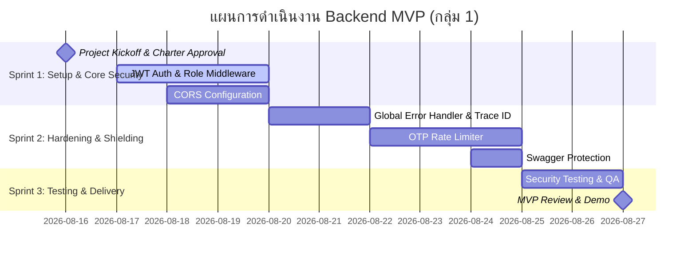

# Project Charter (กฎบัตรโครงการ)
## โครงการ: Backend API Security & Core Hardening MVP (กลุ่ม 1)

---

### 1. ข้อมูลทั่วไปของโครงการ (Project Information)

| หัวข้อ | รายละเอียด |
| :--- | :--- |
| **ชื่อโครงการ** | Backend API Security & Core Hardening MVP |
| **กลุ่มผู้รับผิดชอบ** | กลุ่ม 1 (Group 1) |
| **สถานะโครงการ** | Approved / In Progress |
| **เวอร์ชันเอกสาร** | Version 1.0 |
| **วันที่จัดทำ** | 16 สิงหาคม 2026 |
| **กรอบการทำงาน** | Agile / Scrum Framework |

---

### 2. ความเป็นมาและภาพรวมโครงการ (Executive Summary & Background)

ระบบ Backend API เดิมมีความเสี่ยงด้านความปลอดภัยของข้อมูล ช่องโหว่จากการกำหนดสิทธิ์ที่หละหลวม การรั่วไหลของข้อมูลภายในระบบผ่าน Error Logs และการไม่มีกลไกป้องกันการโจมตีอัตโนมัติ (Automated Attacks) ส่งผลให้ระบบเสี่ยงต่อการถูกเจาะระบบ (Data Breach), ข้อมูลรั่วไหล (Data Leakage) และค่าใช้จ่ายส่วนเกินจาก SMS Gateway

โครงการ **MVP กลุ่ม 1** จึงมุ่งเน้นการยกระดับความปลอดภัยของฝั่ง Backend API ให้เป็นไปตามมาตรฐานความมั่นคงปลอดภัยสารสนเทศ (OWASP Top 10) ผ่าน 5 ฟังก์ชันแกนหลักด้านการป้องกันและควบคุมการเข้าถึง

---

### 3. วัตถุประสงค์ของโครงการ (Project Objectives - SMART Goals)

1. **ปิดช่องโหว่การเข้าถึงข้อมูลโดยไม่ได้รับอนุญาต (Broken Access Control):** ควบคุมสิทธิ์ระดับ Role และ Route ให้ปลอดภัย 100%
2. **จำกัดการเข้าถึงจากภายนอก:** อนุญาตเฉพาะ Origin/Domain ที่ได้รับอนุญาตเท่านั้นผ่าน CORS Policy
3. **ป้องกันข้อมูลระบบรั่วไหล (Information Disclosure):** ปิดกั้นการส่ง Stack Trace, Database Schema หรือ SQL Error ไปยัง Client
4. **ป้องกันการโจมตีแบบ Brute-force & SMS Bombing:** จำกัดความถี่การขอและยืนยันรหัส OTP อย่างรัดกุม
5. **ปกป้องพิมพ์เขียวของระบบ (API Blueprint Protection):** ซ่อนหรือจำกัดสิทธิ์การเข้าถึง Swagger/OpenAPI Spec ในสภาพแวดล้อม Production

---

### 4. สรุปขอบเขตงาน MVP (Scope of Work - Key Modules)

```
+-----------------------------------------------------------------------+
|                           Backend API MVP                             |
+-----------------------------------------------------------------------+
|  1. JWT Auth & RBAC Middleware  --> ปิดรูรั่วข้อมูลและ Export         |
|  2. CORS Configuration          --> ปิดกั้น Unapproved Origins        |
|  3. Global Error Handler        --> ป้องกัน SQL/Internal Leaks        |
|  4. OTP Rate Limiter            --> กัน Brute-force & SMS Bombing     |
|  5. Swagger Docs Protection     --> ซ่อน API Spec บน Production       |
+-----------------------------------------------------------------------+
```

1. **JWT Authentication & Role Middleware:** ตรวจสอบ Token และบังคับใช้สิทธิ์ (RBAC) เพื่อป้องกันการเข้าถึง Endpoint ข้อมูลและ Route Export
2. **CORS Configuration:** บังคับใช้ Whitelist Domain และจัดการ Preflight `OPTIONS` Request อย่างปลอดภัย
3. **Global Error Handler:** ดักจับ Exception ส่วนกลาง ซ่อน Raw SQL / Stack Trace ตอบกลับเป็น Generic Error พร้อม `trace_id`
4. **OTP Rate Limiter:** จำกัดการขอ OTP (3 ครั้ง / 15 นาที / เบอร์) และล็อก Transaction หากกรอกผิดเกิน 5 ครั้ง
5. **Swagger Docs Protection:** ปิดกั้นการเข้าถึง Swagger UI และ OpenAPI Spec บน Production

---

### 5. ดัชนีเอกสารประกอบโครงการ (Project Documentation Index)

สำหรับรายละเอียดเชิงลึกในแต่ละด้าน ได้ทำการแยกเป็นเอกสารเฉพาะทางดังนี้:

* 📄 **[Requirements Specification (SRS)](./requirements_specification.md):** ข้อกำหนดความต้องการเชิงหน้าที่ (FR-01 ถึง FR-10) และความต้องการเชิงคุณภาพ (NFR ด้าน Security, Performance, Reliability)
* 📄 **[Acceptance Criteria & Test Scenarios](./acceptance_criteria.md):** เกณฑ์การตรวจรับงานในรูปแบบ Given-When-Then, Test Cases Matrix และ Definition of Done
* 📄 **[Database Design & Schema](./database_design.md):** แผนภาพ ER Diagram, พจนานุกรมข้อมูล (Data Dictionary), DDL Scripts และแนวทางการรักษาความปลอดภัยของฐานข้อมูล

---

### 6. สิ่งที่อยู่นอกเหนือขอบเขต (Out of Scope)

* การพัฒนาระบบ UI / Frontend Components (ทำเฉพาะการเชื่อมต่อเพื่อทดสอบ API)
* การเชื่อมต่อ Payment Gateway
* โครงสร้างแบบ Full Microservices / Service Mesh
* ระบบ Automated CI/CD Deployment ขั้นสูง (ยกยอดไป Phase ถัดไป)

---

### 7. เกณฑ์การส่งมอบโครงการ (Definition of Done - DoD)

1. [ ] **JWT & RBAC:** Middleware ผ่านการทดสอบ Unit & Integration Test สำหรับทุก Role และ Endpoint Export
2. [ ] **CORS:** ผ่านการทดสอบจาก Origin ภายนอก และ Unauthorized Domain ถูกบล็อกอย่างสมบูรณ์
3. [ ] **Error Masking:** เมื่อจำลอง Database Crash ต้องไม่มี Raw SQL/Stack Trace หลุดไปยัง Client และมี Trace ID บันทึกใน Log
4. [ ] **Rate Limiting:** ระบบตอบกลับ HTTP `429 Too Many Requests` เมื่อส่งคำขอเกินโควตา
5. [ ] **Swagger Security:** Swagger UI และ API Spec ไม่สามารถเปิดได้บน Production Environment
6. [ ] **Code Review & Quality:** ผ่านการ Code Review 100% และ Unit Test Coverage $\ge$ 80%

---

### 8. บทบาทและความรับผิดชอบของทีม (Team Roles & RACI Matrix)

| หน้าที่ | บทบาทในทีม | ความรับผิดชอบหลัก |
| :--- | :--- | :--- |
| **Product Owner (PO)** | ทีมผู้ดูแลผลิตภัณฑ์ | กำหนดทิศทาง, ลำดับความสำคัญ และตรวจรับมอบฟังก์ชันงาน |
| **Scrum Master (SM)** | ผู้ดูแลกระบวนการ Agile | อำนวยความสะดวก ขจัดอุปสรรค และประสานงานใน Sprint |
| **Backend Developer 1** | กลุ่ม 1 Developer | พัฒนา JWT Auth, RBAC Middleware และ Swagger Protection |
| **Backend Developer 2** | กลุ่ม 1 Developer | พัฒนา Rate Limiter, CORS Policy และ Global Error Handler |
| **QA / Security Tester** | ทีมทดสอบ | ทำ Penetration/Vulnerability Testing และเขียน Test Cases |

#### RACI Matrix:
* **R (Responsible):** กลุ่ม 1 Backend Developers
* **A (Accountable):** Product Owner / Tech Lead
* **C (Consulted):** Security Consultant / System Architect
* **I (Informed):** สมาชิกในทีมและ Stakeholders ทั้งหมด

---

### 9. การบริหารความเสี่ยง (Risk Management Matrix)

| ความเสี่ยง (Risk) | ผลกระทบ | โอกาสเกิด | แนวทางป้องกันและแก้ไข (Mitigation Strategy) |
| :--- | :---: | :---: | :--- |
| **CORS บล็อก Frontend ทีมตนเอง** | สูง | ปานกลาง | ทำ Environment Config แยกชัดเจนระหว่าง Local, Staging, และ Production |
| **Rate Limit บล็อกผู้ใช้งานจริง** | ปานกลาง | ต่ำ | กำหนดเกณฑ์ Throttling ที่เหมาะสม และมี Mechanism ปลดล็อกหลังหมดเวลา |
| **Token หมดอายุเร็วเกินไป** | ปานกลาง | ปานกลาง | ออกแบบระบบ Refresh Token ควบคู่กับ Access Token |
| **การปิด Error ทำให้ Debug ยาก** | ปานกลาง | ปานกลาง | ผูก Unique Request ID (Trace ID) ลงใน Response และ Log เพื่อให้ Developer ส่อง Log ได้ง่าย |

---

### 10. แผนการดำเนินงานและกำหนดการ (Sprint Schedule / Milestones)



---

### 11. การอนุมัติโครงการ (Approval & Sign-off)

| ตำแหน่ง | ลงชื่อ | วันที่ |
| :--- | :--- | :--- |
| **Product Owner** | _____________________________ | _____/_____/_________ |
| **Scrum Master** | _____________________________ | _____/_____/_________ |
| **Tech Lead / Group 1 Lead** | _____________________________ | _____/_____/_________ |
